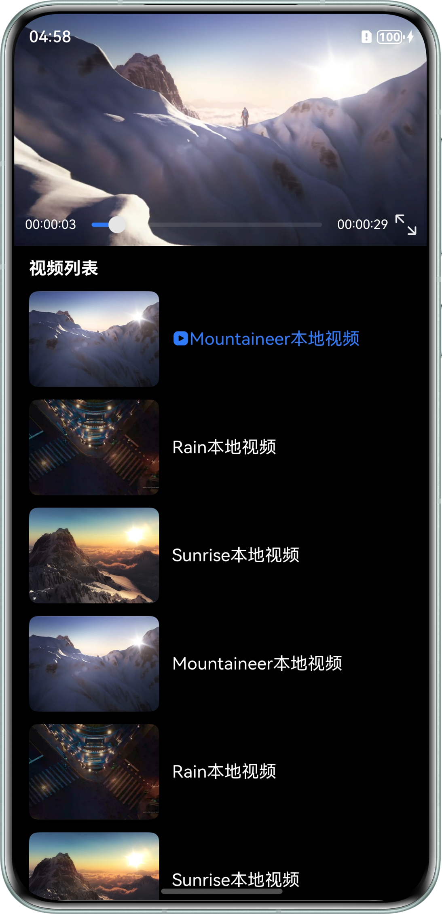
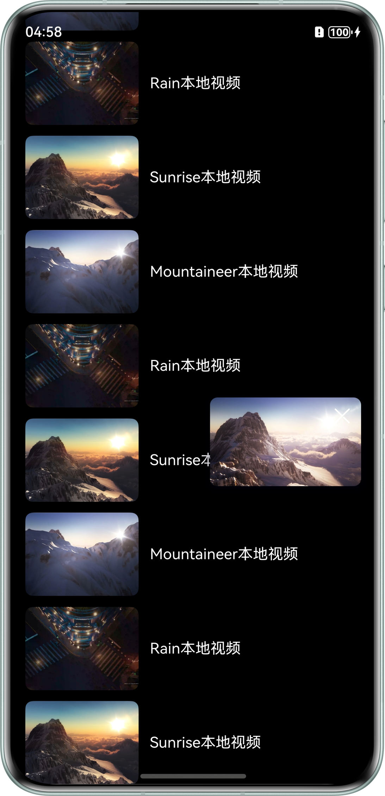
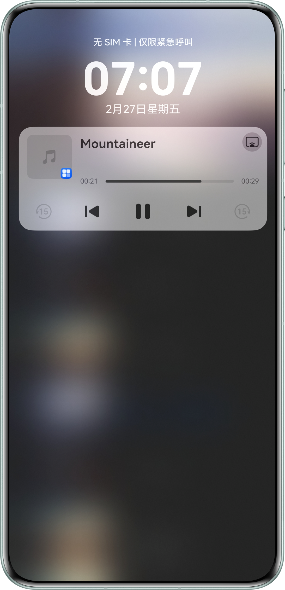
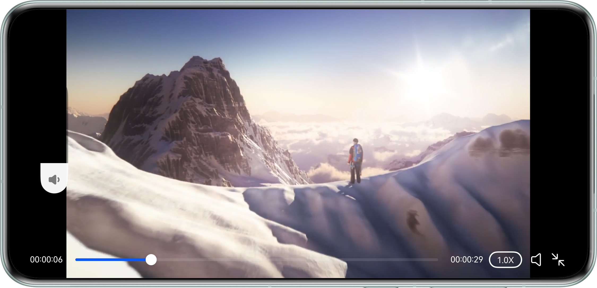

# 基于Video组件播放长视频

## 项目简介
本示例基于Video组件实现了播放长视频功能，指导开发者如何通过Video组件实现长视频播放，如：基础播控、视频首帧显示、自定义播放进度条、前台小窗播放、循环播放、视频全屏播放、视频音量设置、静音播放、长按倍速播放、点击选择倍速播放、接入播控中心等功能场景。

## 效果预览

| 首页                                                      | 小窗播放                                                      | 接入播控中心                                                   |
|---------------------------------------------------------|-----------------------------------------------------------|----------------------------------------------------------|
|  |  |  |

| 横屏-音量调节                                               | 
|-------------------------------------------------------|
|  |


## 使用说明
1. 安装进入应用。
2. 点击视频区域播放/暂停播放本地视频，并可通过点击视频列表内容切换视频。
3. 点击Slider实现视频跳转播放。
4. 点击右下角按钮，进入全屏播放。
5. 进入全屏后：
   1. 滑动视频左侧区域，实现音量调节。
   2. 点击播放速度按钮，选择视频播放倍速。
   3. 长按视频区域，实现视频倍速播放。
   4. 点击右下角静音按钮，实现静音播放。
6. 视频播放时，通过播控中心控制视频的播放、暂停、跳转播放、点击播放上一个/下一个视频。

## 工程目录
```
├──entry/src/main/ets
│  ├──constants
│  │  ├──CommonConstants.ets            // 常量
│  │  └──VideoStatus.ets                // Video状态
│  ├──controller
│  │  └──AVSessionController.ets        // AVSession控制类
│  ├──entryability
│  │  └──EntryAbility.ets               // 程序入口
│  ├──entrybackupability
│  │  └──EntryBackupAbility.ets         // 备份恢复类
│  ├──module
│  │  ├──VideoData.ets                  // Video数据
│  │  └──VideoType.ets                  // Video类型接口
│  ├──pages
│  │  └──Index.ets                      // Video视频播放页
│  └──utils
│  │  ├──BackgroundTaskManager.ets      // 后台任务管理类
│  │  ├──FotmatTime.ets                 // 时间格式转换工具类
│  │  ├──Logger.ets                     // 日志打印类
│  │  └──WindowUtil.ets                 // 窗口类
│  └──view
│     ├──SmallVideo.ets                 // 小窗播放视频页面
│     ├──VideoList.ets                  // 视频列表页面
│     └──VolumeView.ets                 // 音量调节
└──entry/src/main/resources             // 应用资源目录
```
## 具体实现

1. 基于Video组件实现视频的基本播控，如：视频首帧显示、播放、暂停、循环播放、倍速播放、静音播放等功能。
2. 结合Slider组件实现自定义播放进度条，点击进度条实现视频跳转播放。
3. 结合自定义组件实现滑动视频列表区域，实现视频小窗播放。
4. 通过窗口管理器WindowStage实现视频播放时，横屏和竖屏状态的切换控制。
5. 通过AVSession和backgroundTaskManager实现视频接入播控中心，及通过播控中心控制视频播放、暂停、跳转播放、播放上一个/下一个视频等功能。

## 相关权限

- ohos.permission.KEEP_BACKGROUND_RUNNING：允许Service Ability在后台持续运行。

## 约束与限制

本示例仅支持标准系统上运行，支持设备：直板机。

1. HarmonyOS系统：HarmonyOS 6.0.2 Release及以上。
2. DevEco Studio版本：DevEco Studio 6.0.2 Release及以上。
3. HarmonyOS SDK版本：HarmonyOS 6.0.2 Release SDK及以上。